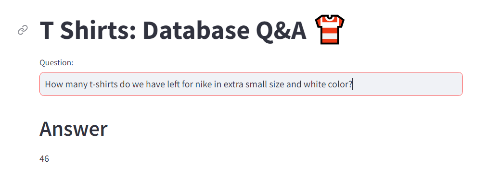

# QueryAI - an AI-Driven Query System for Data Management

This is an end to end LLM project based on Google Palm and Langchain. The system can communicate with a MySQL database. When a user asks a question in natural language, the system turns that question into an SQL query and runs it on the MySQL database to get an answer.



The User will may ask questions such as:

- How many white color Adidas t shirts do we have left in the stock?
- How much sales our store will generate if we can sell all extra-small size t shirts after applying discounts? 

The system is intelligent enough to generate accurate queries for given question and execute them on MySQL database.


## Features
Sales and discounts data is stored in a MySQL database.

We will build a question-and-answer system using a large language model (LLM) that includes:

- Google Palm LLM
- Hugging Face embeddings
- Streamlit for the user interface (UI)
- Langchain framework
- Chromadb as a vector store
- Few-shot learning


In the UI, the store manager will ask questions in natural language, and the system will generate answers.

## How it works?

* **Google Palm LLM**:
  * The Google Palm large language model is used to understand and process natural language questions asked by the store manager.
  * It helps in generating SQL queries from the natural language input.
* **Hugging Face Embeddings**:
  * Hugging Face embeddings are used to convert natural language questions into a format that the system can understand and work with.
  * These embeddings help in improving the accuracy and relevance of the generated SQL queries.
* **Streamlit for UI**:
  * Streamlit is used to create a user-friendly interface where the store manager can type in their questions.
  * The interface is designed to be simple and intuitive, allowing easy interaction with the system.
* **Langchain Framework**:
  * The Langchain framework is used to connect the different components of the system.
  * It manages the flow of information from the user interface to the language model and then to the database.
* **Chromadb as a Vector Store**:
  * Chromadb is used to store and manage vector representations of the data.
  * It helps in quickly retrieving relevant data when processing queries.
* **Few-Shot Learning**:
  * Few-shot learning techniques are used to improve the system's ability to understand and generate accurate answers from limited examples.
  * This approach allows the system to learn and adapt quickly to new types of questions with minimal training data.


## Installation

1.Clone this repository to your local machine using:

```bash
  git clone https://github.com/theayushsonkar/QueryAI.git
```
2.Navigate to the project directory:

```bash
  cd QueryAI
```
3. Install the required dependencies using pip:

```bash
  pip install -r requirements.txt
```
4.Acquire an api key through makersuite.google.com and put it in .env file

```bash
  GOOGLE_API_KEY="your_api_key_here"
```
5. For database setup, run database/db_creation_atliq_t_shirts.sql in your MySQL workbench

## Usage

1. Run the Streamlit app by executing:
```bash
streamlit run main.py
```

2.The web app will open in your browser where you can ask questions

## Sample Questions
  - How many total t shirts are left in total in stock?
  - How many t-shirts do we have left for Nike in XS size and white color?
  - How much is the total price of the inventory for all S-size t-shirts?
  - How much sales amount will be generated if we sell all small size adidas shirts today after discounts?
  
## Project Structure

- main.py: The main Streamlit application script.
- langchain_helper.py: This has all the langchain code
- requirements.txt: A list of required Python packages for the project.
- few_shots.py: Contains few shot prompts
- .env: Configuration file for storing your Google API key.